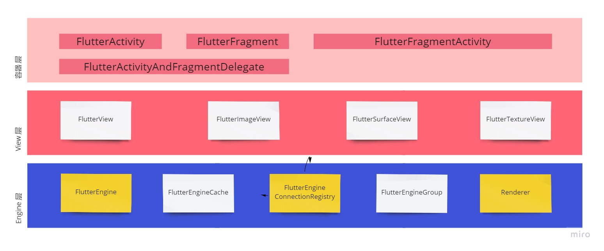

## Android Flutter Embedded
## 层级关系

### 容器 层
- FlutterActivity：Flutter 页面的容器 
- FlutterFragment：比 FlutterActivity 更轻量的容器
- FlutterFragmentActivity
- FlutterActivityAndFragmentDelegate：公共逻辑实现层
  - Host：需要对应的宿主（FlutterActivity / FlutterFragment）独立实现的逻辑部分

### View 层
- FlutterView：由 FlutterEngine 绘制 Flutter UI 到 FlutterView 上。
- FlutterImageView：通过 ImageReader 向 Canvas 绘制 Flutter UI。
- FlutterSurfaceView：在 Surface 上绘制 Flutter UI。
- FlutterTextureView：在 SurfaceTexture 上绘制 Flutter UI。

### Engine 层
 - FlutterEngine：Flutter 引擎
 - FlutterEngineCache：通过一个 id 进行引擎缓存的机制
 - FlutterEngineConnectionRegistry：管理 Android App Components 和 Flutter 插件的连接
 - FlutterEngineGroup：一种共享资源的多引擎创建方式，带来极少的开销
 - FlutterJNI：Flutter embedding 层的 Java 代码和 Flutter engine's C/C++ code 之间的接口
 - **【Renderer】**：引擎渲染部分
   - FlutterRenderer：引擎中负责绘制的部分
   - FlutterUiDisplayListener：监听 Flutter 开始 / 结束向 View 绘制的时机
   - RenderSurface：为 FlutterRenderer 提供绘制所需的 Surface
   - SurfaceTextureWrapper：用于追踪 SurfaceTexture 中的 texture 被释放的时机